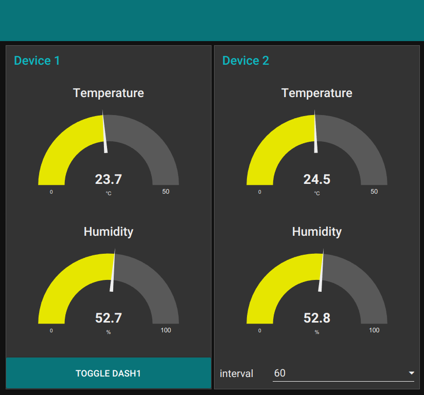
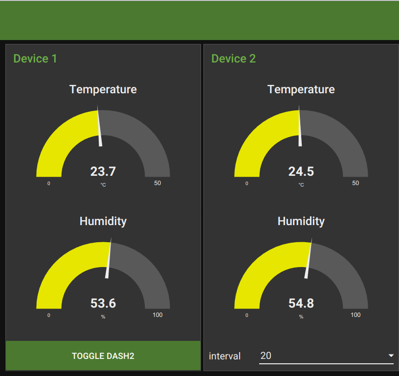

# Presentacion IoT: Esp32 + MQTT + NodeRed - 1 Nov 2021 - Eduardo Martinez

## Documentos presentados en esta carpeta

##  proj-42-mqtt2.pdf:

Diagrama de como están construídos los módulos del programa

##  ESP32.ppt

Filminas proyectadas para explicar ESP32

##  MQTT.ppt

Filminas proyectadas para explicar MQTT

## Diagrama-MQTT-20211101.pdf

Diagrama MQTT del ejemplo que se presentó en clase

Incluye las dos placa con ESP32 y los dos dashboards en node-red
cuyos flujos se incluyen a continuación denominados:

* esp32-dash1.json
* esp32-dash2.json

##  Flujos (flows) de node-red presentados en la clase

En cada uno de estos archivos se encuentran los siguientes flujos

* HelloWorld.json:  ejemplo sencillo de un flujo que presenta 'Hello World'
* mqtt.json:        muestra como trabajar con un broker MQTT desde node-red
* BlinkLed.json:    primer ejemplo con un elemento de dashboard: un led   (ver nota mas abajo)
* BAWeather.json:   ejemplo completo de presentar el estado del tiempo desde un servidor
                    que se puede preguntar el mismo (en este caso el de la Ciudad de Buenos Aires)
                    y presentarlo en un dashboard
* esp32-dash1.json: Ejemplo completo para trabajar con el broker MQTT y las placas
                    con ESP32 y el sensor DHT22. Se trata de el flujo de un dashboard
* esp32-dash2.json: Ejemplo completo igual al anterior pero que reside en un node-red
                    que, en el caso del ejemplo que se mostro, residia en un celular

#### Nota: para hacer luego de cargar y poner a funcionar node-red

Para seguir el ejemplo completo mostrado en clase, luego de cargar y ejecutar node-red
en ambas computadoras, se deben cargar los nodos de dashboard, ya que no vienen instalados
por default y, en el caso de lo que yo construi, ademas hay que agregar un nodo dentro de
dashboard para generar leds

* Para agregar los nodos de dashboard: desde node-red cargar -> node-red-dashboard
* Para agregar el nodo de led dentro de dashboard: desde node-red cargar -> node-red-contrib-ui-led

## Fotos

  Se incluyen las siguientes fotos:

#### dash1

  

#### dash2

  

## Videos

###  Node-Red

 [Introduction - Node-RED Essentials - From nodered.org](https://www.youtube.com/watch?v=ksGeUD26Mw0)

 [Qué es Node-RED? - Introducción, Node-RED en la Industria, Node-RED e IoT](https://www.youtube.com/watch?v=sl8LzOIvJS0)

##  MQTT

 [Desentrañando MQTT - ¿Cómo funciona?](https://www.youtube.com/watch?v=Tb1t6GKJ0r0)

 [MQTT & ESP32.: (1). Ejemplo sensor de temperatura DHT22](https://www.youtube.com/watch?v=pEv90rO_MD0&list=RDLVx5GML1FqcTQ&index=3)

## Tutoriales

###  Node-Red

  [Node-Red Tutorials - From nodered.org](https://nodered.org/docs/tutorials/)

  [Step by step guide to install Node-RED on Ubuntu 18.04 LTS](https://www.techunits.com/topics/setup-guides/step-by-step-guide-to-install-node-red-on-ubuntu-18-04-lts/)

### MQTT

  [MQTT: The Standard for IoT Messaging - from mqtt.org](https://mqtt.org/)

  [10 Free Public MQTT Brokers(Private & Public)](https://mntolia.com/10-free-public-private-mqtt-brokers-for-testing-prototyping/)

  [mosquitto download](https://mosquitto.org/download/)

